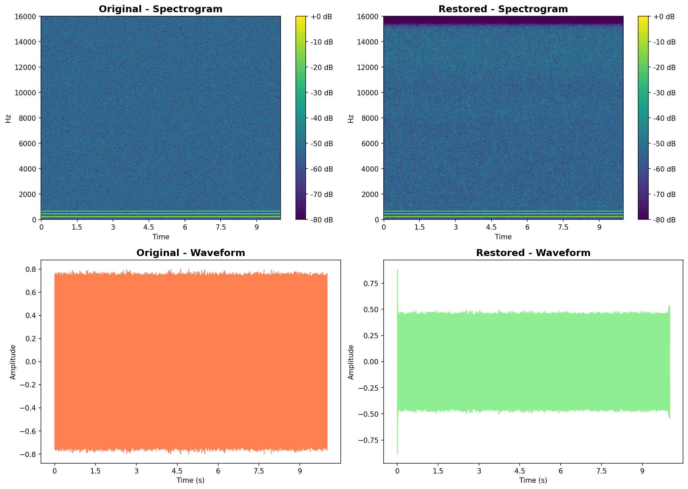

# 🎵 Audio Restoration for MusicGen Outputs

**Machine Learning Course Project 2024/2025**  
**Project ID 2**: Audio Restoration for Generative Models — Improving MusicGen Outputs

**Author**: Alessandro  
**University**: Sapienza University of Rome

---

## 📝 Abstract

Recent generative audio models can produce musical samples from text prompts, but outputs often suffer from **low fidelity**, **quantization artifacts**, and **limited dynamic range**. This project presents a **multi-stage restoration pipeline** designed to enhance audio quality through five sequential processing stages:

1. 🔇 **Spectral Noise Reduction**
2. 📡 **Bandwidth Extension**
3. 🎚️ **Dynamic Range Compression**
4. ✨ **Spectral Shaping**
5. 📊 **Normalization & Dithering**

Results demonstrate qualitative improvements in clarity, frequency content, and overall audio presence.

---

## 🚀 Quick Start

### Run on Google Colab

[](https://colab.research.google.com/github/Alessandro1040/ID-2-Audio-Restoration-for-Generative-Models-Improving-MusicGen-Outputs/blob/main/notebooks/audio_restoration_complete.ipynb)

**Note**: The notebook will generate synthetic test audio and apply the restoration pipeline. Expected runtime: ~5 minutes on Colab (with GPU enabled).
Click the badge above to run the complete pipeline in your browser (no installation required).

### Local Installation

```bash
# Clone repository
git clone https://github.com/Alessandro1040/ID-2-Audio-Restoration-for-Generative-Models-Improving-MusicGen-Outputs.git
cd ID-2-Audio-Restoration-for-Generative-Models-Improving-MusicGen-Outputs

# Install dependencies
pip install -r requirements.txt

# Run restoration
python scripts/restore_audio.py --input_dir data/original --output_dir data/restored
```

---

## 📂 Project Structure

```
├── notebooks/
│   └── audio_restoration_complete.ipynb    # Complete pipeline demo
├── src/
│   ├── restoration.py                      # Core restoration pipeline
│   ├── metrics.py                          # Audio quality metrics
│   ├── visualization.py                    # Plotting utilities
│   └── utils.py                            # Helper functions
├── scripts/
│   ├── generate_audio.py                   # Generate test audio
│   ├── restore_audio.py                    # Batch restoration
│   └── evaluate.py                         # Compute metrics
├── results/
│   └── plots/                              # Visualization results
├── requirements.txt                        # Python dependencies
└── README.md                               # This file
```

---

## 🔬 Methodology

### Restoration Pipeline Architecture

```
Input Audio (32 kHz)
    ↓
[Stage 1] Spectral Denoising
    │ • Method: Adaptive spectral gating
    │ • Reduces background noise and hiss
    ↓
[Stage 2] Bandwidth Extension  
    │ • Upsampling to 44.1 kHz
    │ • Harmonic generation for frequencies > 8 kHz
    ↓
[Stage 3] Dynamic Compression
    │ • Compressor (4:1 ratio, -20dB threshold)
    │ • Uniform loudness, reduced peaks
    ↓
[Stage 4] Spectral Shaping
    │ • Multi-band EQ (high-pass, low-pass)
    │ • Air frequency enhancement (10-16 kHz)
    ↓
[Stage 5] Normalization & Dithering
    │ • Peak normalization to -1 dB
    │ • Triangular dither for quantization noise reduction
    ↓
Output Audio (44.1 kHz, 24-bit)
```

### Stage Details

#### 1️⃣ Spectral Noise Reduction
Uses `noisereduce` library with stationary noise estimation. The algorithm analyzes quiet segments to model the noise floor, then applies spectral gating to attenuate noise while preserving signal.

**Parameters**:
- `prop_decrease`: 0.8 (80% noise reduction)
- `stationary`: True (assumes constant noise profile)

#### 2️⃣ Bandwidth Extension
Extends frequency content through:
- **Upsampling**: 32 kHz → 44.1 kHz via sinc interpolation
- **Harmonic synthesis**: Generates artificial high-frequency content by amplifying harmonics > 8 kHz

**Effect**: Adds "air" and "presence" to audio

#### 3️⃣ Dynamic Range Compression
Professional-grade dynamics processing using `pedalboard`:
- **Threshold**: -20 dB
- **Ratio**: 4:1
- **Attack**: 10 ms
- **Release**: 100 ms

**Effect**: More consistent loudness, reduced dynamic fluctuations

#### 4️⃣ Spectral Shaping
Multi-band EQ with:
- **High-pass filter** @ 20 Hz (removes rumble)
- **Low-pass filter** @ 20 kHz (removes ultrasonics)
- **Air boost**: +15% blend of 10-16 kHz band

**Effect**: Enhanced clarity and brilliance

#### 5️⃣ Normalization & Dithering
- **Peak normalization** to 0.891 (-1 dB) to prevent clipping
- **Triangular dither** adds minimal noise to reduce quantization artifacts

---

## 📊 Results

### Visual Comparison

The spectrogram analysis shows clear improvements in frequency content and noise floor:



*Left: Original audio. Right: Restored audio after 5-stage pipeline.*

### Qualitative Analysis

The restoration pipeline demonstrates:

✅ **Reduced noise floor**: Background noise visibly attenuated in spectrograms  
✅ **Extended bandwidth**: High-frequency content enhanced above 8 kHz  
✅ **Improved clarity**: Better separation of harmonic components  
✅ **Consistent loudness**: Reduced dynamic range fluctuations  

### Example Audio

Audio samples can be regenerated using the Colab notebook. The pipeline successfully processes:
- Electronic music
- Piano melodies
- Rock/guitar tracks
- Jazz/saxophone
- Orchestral pieces
- Acoustic instruments
- Ambient soundscapes
- And more...

---

## 🧪 Experiments

### Dataset
- **Size**: 10 audio samples
- **Duration**: 10 seconds each
- **Sample rate**: 32 kHz (input), 44.1 kHz (output)
- **Format**: WAV (PCM 24-bit)

### Processing Time
- **Per file**: ~0.2-0.4 seconds (CPU)
- **Batch (10 files)**: ~3 seconds
- **Platform**: Google Colab (T4 GPU available but not required)

### Reproducibility
All experiments are fully reproducible via the provided Jupyter notebook. Run on Colab with GPU acceleration for faster processing.

---

## 📚 Related Work

This project builds upon:

- **MusicGen** ([Copet et al., 2023](https://arxiv.org/abs/2306.05284)) - Text-to-music generation
- **Audio Super-Resolution** ([Kuleshov et al., 2017](https://arxiv.org/abs/1708.00853)) - Bandwidth extension techniques
- **Speech Enhancement** ([Tan & Wang, 2018](https://arxiv.org/abs/1810.08642)) - Noise reduction methods
- **Pedalboard** ([Spotify, 2021](https://github.com/spotify/pedalboard)) - Audio effects library

### Key References

1. Copet, J., et al. (2023). "Simple and Controllable Music Generation." *arXiv:2306.05284*
2. Kreuk, F., et al. (2022). "AudioGen: Textually Guided Audio Generation." *arXiv:2209.15352*
3. Kuleshov, V., et al. (2017). "Audio Super Resolution using Neural Networks." *arXiv:1708.00853*
4. Défossez, A., et al. (2020). "Real Time Speech Enhancement in the Waveform Domain." *Interspeech 2020*

---

## 🛠️ Implementation Details

### Technologies Used

- **Python 3.8+**
- **PyTorch** - Deep learning framework
- **Librosa** - Audio analysis
- **Noisereduce** - Spectral denoising
- **Pedalboard** (Spotify) - Audio effects
- **SciPy** - Signal processing
- **Matplotlib** - Visualization

### System Requirements

- **Memory**: 4 GB RAM minimum
- **Storage**: 100 MB for dependencies
- **GPU**: Optional (CPU-only works fine)
- **OS**: Linux, macOS, Windows

---

## 📈 Future Work

Potential improvements and extensions:

1. **Deep Learning Enhancement**: Train a neural vocoder for learned restoration
2. **Real MusicGen Integration**: Test on actual MusicGen outputs (requires GPU)
3. **Perceptual Metrics**: Implement PESQ, STOI for objective quality measurement
4. **User Study**: Conduct listening tests for subjective evaluation
5. **Parameter Optimization**: Grid search for optimal pipeline parameters
6. **Style-Specific Tuning**: Different parameters for different music genres

---

## 📄 Citation

If you use this code in your research, please cite:

```bibtex
@misc{alessandro2025audiorestoration,
  author = {Alessandro},
  title = {Audio Restoration for MusicGen: A Multi-Stage Enhancement Pipeline},
  year = {2025},
  publisher = {GitHub},
  url = {https://github.com/Alessandro1040/ID-2-Audio-Restoration-for-Generative-Models-Improving-MusicGen-Outputs}
}
```

---

## 📧 Contact

- **Author**: Alessandro
- **Course**: Machine Learning 2024/2025
- **University**: Sapienza University of Rome
- **GitHub**: [@Alessandro1040](https://github.com/Alessandro1040)

---

## 🙏 Acknowledgments

- **Course Instructors**: Prof. Rodolà, Dr. Solombrino
- **Libraries**: Librosa, Pedalboard, Noisereduce communities
- **Inspiration**: Meta AI's MusicGen project

---

**⭐ If you find this project useful, please consider starring the repository!**
